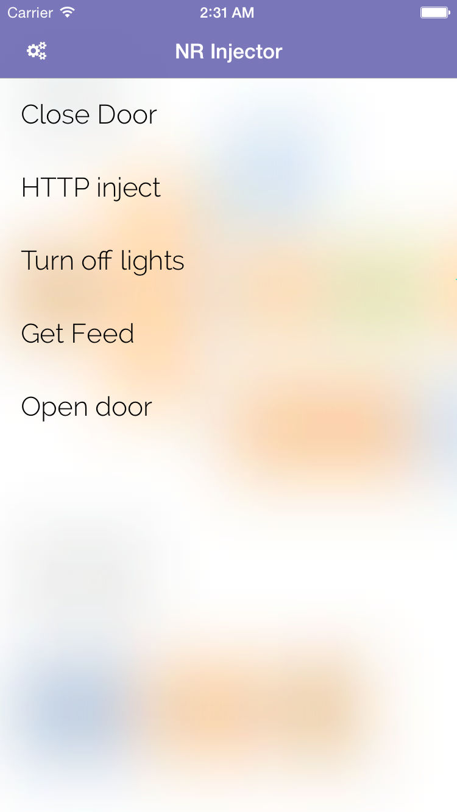
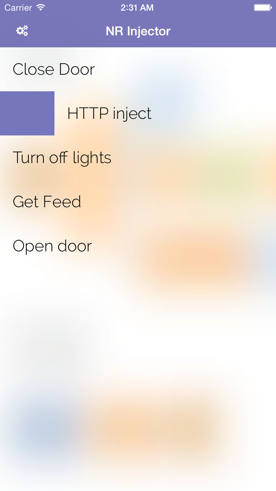
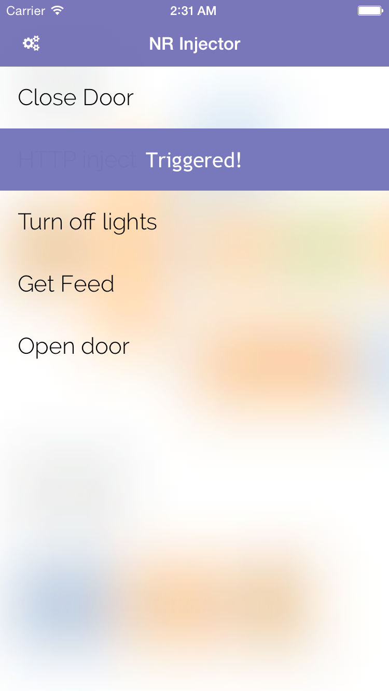
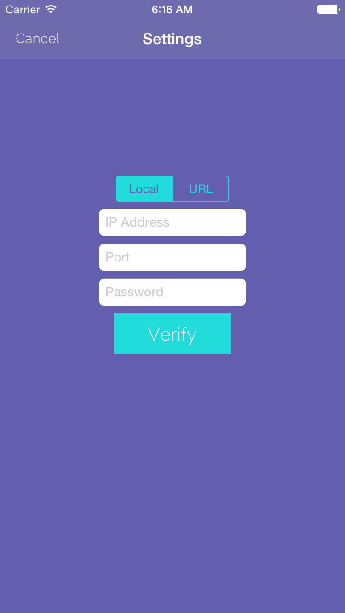

#NR Inject

NR Inject is a useful development tool for Node-Red. With NR Inject, you will be able to interact directly with your Node-Red without any complicated set or instructions. Simply input your IP Address and the password you set up in your "NR Injector" node in Node-Red and inject away!

##Screenshots
   
